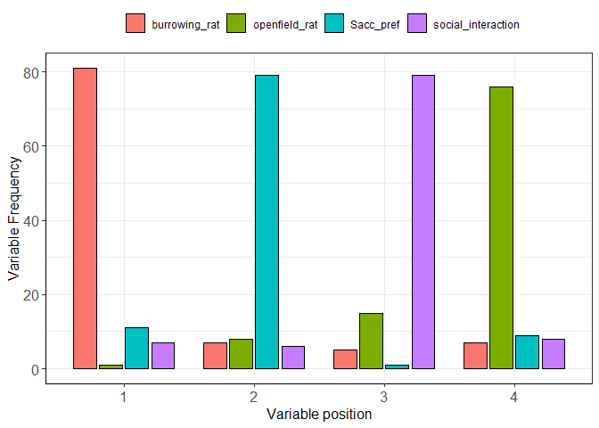

<!-- README.md is generated from README.Rmd. Please edit that file -->

# cms 

# Composite measures schemes (cms)

<!-- badges: start -->

[](https://travis-ci.org/r-lib/usethis)
<!-- badges: end -->

The cms package uses tabular data from rat epilepsy studies and applies
a composite measures scheme (via PCA) to select the most prominent
features. Further, variables can be selected to perform cluster analysis
on a subset in order to build a composite score. Finally, the cluster
distribution is displayed for the subgroups and allows severity
assessment between animal models.

*Please note:* the cms\_analysis and cms\_cluster functions are
deprecated.

[Click here for reading the cms
Vignette.](http://talbotsr.com/cms/articles/cms.html)

## Dependencies

The cms package has some dependencies. We advise installing/updating the
following packages before using cms:

  - ggplot2
  - dplyr
  - factoextra

## Installation

You can install the development version from
[GitHub](https://github.com/) with:

``` r
# install.packages("devtools")
devtools::install_github("mytalbot/cms")
library(cms)
```

## Example cms

The following example uses the (pre-cleaned) internalized epilepsy data
(episet\_full) set with three experimental subgroups. Further, the
feature selection is repeated 100-fold. The example uses the new `cms`
function. Please note that all variables that shall be included must be
specified in the `vars` object.

## Working example

**Note:** the following example shows the pooled data from the
episet\_full set, using the pooled subgroups. You might need to filter
them, if you are interested in specific subsets.

``` r
library(cms)
# Do the cms feature analysis (with a limited set of variables)
usecase <- cms(raw        = episet_full,
               runs       = 100,
               idvariable = "animal_id",
               setsize    = 0.8,
               variables  = c("Sacc_pref", "social_interaction", 
                              "burrowing_rat", "openfield_rat"),
               maxPC      = 4,
               clusters   = 3, 
               showplot   = FALSE)

# This also shows the plot
usecase$p
```



### Table of the cms feature frequency distributions

``` r
head(usecase$FRQ)
#>   position                  x freq perc
#> 1        1      burrowing_rat   81   81
#> 2        1      openfield_rat    1    1
#> 3        1          Sacc_pref   11   11
#> 4        1 social_interaction    7    7
#> 5        2      burrowing_rat    7    7
#> 6        2      openfield_rat    8    8
```
